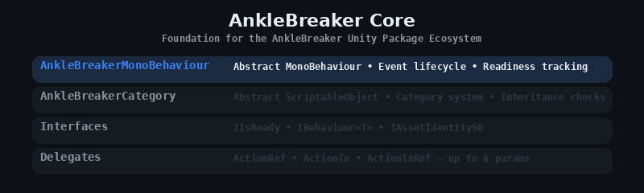

<p align="center">
  
</p>

# AnkleBreaker Core — Unity Package Foundation

> **Core base classes, interfaces, delegates, and script templates for the AnkleBreaker Unity package ecosystem.** Zero dependencies, UPM-ready. Free and open source by [AnkleBreaker Studio](https://github.com/AnkleBreaker-Studio).

[](https://github.com/sponsors/AnkleBreaker-Studio)
[](https://assetstore.unity.com/publishers/101837)

## Installation

Add via Unity Package Manager using the Git URL:

```
https://github.com/AnkleBreaker-Studio/AnkleBreaker-Core.git
```

## What's Included

**Base Classes** — `AnkleBreakerMonoBehaviour` (abstract MonoBehaviour with event handler lifecycle and readiness tracking), `AnkleBreakerCategory` (abstract ScriptableObject for category systems with inheritance checks).

**Interfaces** — `IIsReady` (readiness state), `IBehaviour<T>` (config-based initialization), `IAssetIdentitySO` (identity with categories and localization).

**Delegates** — `ActionRef`, `ActionIn`, `ActionInRef` and variants supporting `ref`/`in` parameter modifiers up to 6 parameters.

**Structs** — `AssetIdentityStruct` (serializable title, description, thumbnail).

**Templates** — Script templates for MonoBehaviour and NetworkBehaviour following AB conventions.

## Optional Dependencies

AnkleBreaker-Core has no required dependencies. It optionally integrates with:

- **AnkleBreaker Utils Inspector** — Provides `[HideInNormalInspector]` attribute on base class fields. Auto-installed if not present.
- **Odin Inspector** — `AnkleBreakerCategory` inherits from `SerializedScriptableObject` when available.

## Part of the AnkleBreaker Ecosystem

| Package | Description |
|---------|-------------|
| **AnkleBreaker-Core** (this) | Base classes, interfaces, delegates |
| [Utils-Inspector](https://github.com/AnkleBreaker-Studio/AnkleBreaker-Utils-Inspector) | 40+ custom inspector attributes (free Odin alternative) |
| [Utils-Extensions](https://github.com/AnkleBreaker-Studio/AnkleBreaker-Utils-Extensions) | 50+ C# extension methods for Unity |
| [Utils-UniversalTypes](https://github.com/AnkleBreaker-Studio/AnkleBreaker-Utils-UniversalTypes) | Universal wrappers for localization, assets, audio |
| [Utils-Editor](https://github.com/AnkleBreaker-Studio/AnkleBreaker-Utils-Editor) | Editor utilities — Gizmos, MonoScript finder, dialogs |
| [FishNet-Core](https://github.com/AnkleBreaker-Studio/AnkleBreaker-FishNet-Core) | FishNet networking layer |
| [Unity MCP](https://github.com/AnkleBreaker-Studio/unity-mcp-server) | 268 AI tools for Unity Editor control |

## Requirements

- Unity 2022.3 LTS or later

## License

See [LICENSE.md](LICENSE.md)
